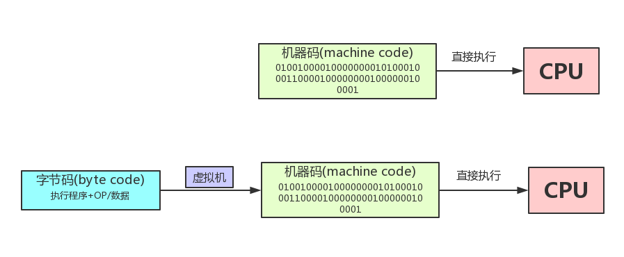
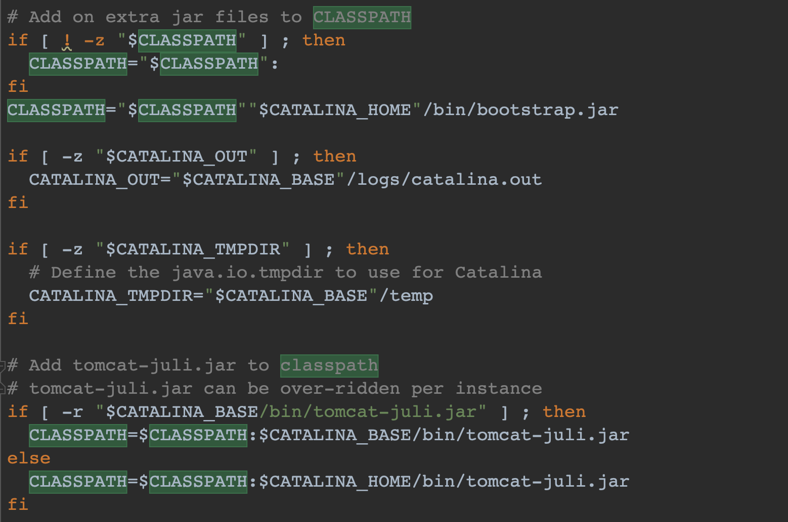
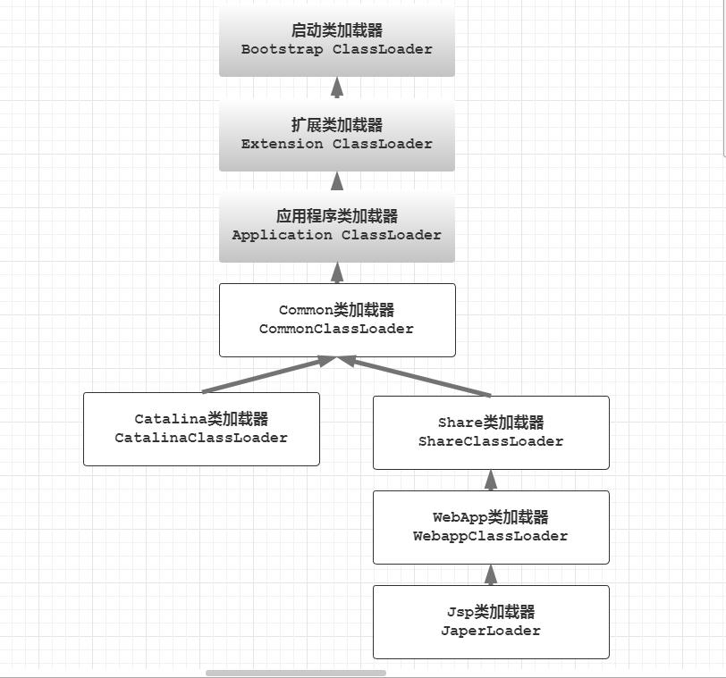

### Java EE   
Java EE是一种架构,也可以说是一种技术规范. Java EE 是由一系列抽象的标准规范所组成,
是针对企业级软件开发中普遍面临问题的一套解决方案. Java EE 是将JSR文档以代码
的形式展现出来 **(每个抽象的JSR规范都是要求有对应的参考实现的.)**.

也就是说, Java EE = 多个JSR正式规范 + 运行环境.

Java EE 作为一套技术规范,其商业实现产品有多种,单单国产的Java EE应用服务器实现就有3个. "一种规范 + 多种实现"的方式
对企业非常友好, 当企业遇到某供应商产品服务不靠谱的话迁移起来就很容易.

Java EE SDK则是java提供的用于开发企业级应用的开发工具包. 它是在Java SE SDK的基础上添加了一些额外的jar包.
用于支持企业级应用开发. 包括但不限于: ejb,servlet,jsp,xml,jpa等;   

企业级应用开发一般分为两个阵营: **1、使用Java EE开发; 2、使用Spring这种所谓的轻量级企业应用框架开发;**

Servlet 是 J2EE 最重要的一部分，有了 Servlet 你就是 J2EE 了，J2EE 的其他方面的内容择需采用。
而 Servlet 规范你需要掌握的就是 servlet 和 filter 这两项技术。绝大多数框架不是基于 servlet 就是基于 filter，
**如果它要在 Servlet 容器上运行，就永远也脱离不开这个模型。**

相关概念:  
1、JCP 与 JSR.  
Java Community Process是一个由oracle（曾经是sun）领导的,负责管理java和接受各种Java Specification Requests的
组织,这个组织很多大厂（例如谷歌，IBM等）都加入了. 
Java Specification Request(JSR)是java的spec,在没有正式确定某版本之前会存在很多Java Specification Requests,
最终JSR会由JCP的成员投票决定. 例如: lambda在JSR335的相关讨论.

### Web.xml
如果 Web 应用不包含任何 servlet、过滤器、或监听器组件或使用注解声明相同的，那么可以不需要 web.xml 文件。
换句话说，只包含静态文件或 JSP 页面的应用程序并不需要一个 web.xml 的存在。

### service()方法
实际上, 在执行doGet()或者doPost()之前,都会先执行service(). 由service()方法进行判断,
到底该调用doGet()还是doPost();   
service(), doGet(), doPost() 三种方式的参数列表都是一样的;   
所以,有时候也会直接重写service()方法,在其中提供相应的服务,就不用区分到底是在doGet还是doPost中了。

### JSP
Servlet的一个比较明显的弊端就是在Servlet中编写html代码很痛苦,效率不高,可读性差,难以维护.   
最好可以在.html文件里面写html代码,同时又能在里面调用java的变量,那也就是JSP了.

为什么JSP可以在html中运行java代码? 因为JSP被转译成了Servlet.

访问Tomcat中JSP页面的执行过程如下:
1. 把 xx.jsp转译为xx_jsp.java;
2. xx_jsp.java 位于tomcat\work\Catalina\localhost\web模块名\org\apache\jsp;
3. xx_jsp.java是一个servlet; xx_jsp.java 被编译为 xx_jsp.class;
4. 执行xx_jsp.class, 生成html;
5. 通过http协议把html 响应返回给浏览器;

xx_jsp.java 继承了类 org.apache.jasper.runtime.HttpJspBase, 而这个类又继承了HttpServlet.

### Byte code ｜ Machine code

### Class Loaders in Java.
JVM搜索的是类，搜索路径由环境变量classpath决定，且有先后顺序。JVM只有类路径，而没有文件系统路径。
而classpath环境变量正是为 JVM 提供搜索类路径的环境。注意，虚拟机不会递归搜索classpath定义的路径。

### Class Loaders in Tomcat.

其中，位于图片中上方的三个类加载器(Bootstrap|Extension|Application ClassLoader)是 JVM 提供的。
CommonClassLoader、CatalinaClassLoader 以及 ShareClassLoader，是Tomcat独有的，
在BootStrap.java初始化操作中，进行类加载器初始化。

Bootstrap Classloader是JVM 自身的一部分，主要加载的是JVM 自身需要的类，这个类加载器是使用C++语言实现的。