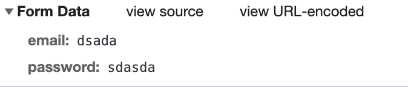

### 1. 前后端数据传递

前提: 前端请求使用Ajax、后端使用Java EE Servlet的request.getParameter()来接收参数;

不同情况:
- Ajax配置参数Content-type: ‘application/json’ + data: JSON.stringfy({}),此时请求体参数是JSON格式的,
但是后端Servlet接收到的参数为null;
- Ajax配置参数Content-type: ‘application/json’ + data: {}，此时请求体参数不是JSON格式的,如下图,
而是参数拼接成的字符串,后端Servlet接收到的参数同样为null;

- Ajax配置参数：去除Content-type: ‘application/json’、data: {},此时请求体参数不是JSON格式的,如下图,
而是Form表单数据,后端Servlet能接收到参数;

### 2. Tomcat容器中运行Java EE Servlet 报错.
报错内容为: "java.lang.ClassNotFoundException:javax.servlet.http.HttpServlet”.   
问题解决:   
(1)可能是因为Tomcat的版本太新,提供的JAR包有所变动,导致找不到需要用的包,可以使用Tomcat较旧版本;   
(2)也可以将源Java文件中的Servlet依赖修改为使用当前使用的Tomcat/lib中的JAR包;

### 3. 访问Tomcat服务,报错"cannot be cast to javax.servlet.Servlet".
原因: Tomcat容器中已经提供了各种jar包(JAR包可以在lib目录下找到),如果WEB-INF下lib文件夹下仍提供相同的jar包就会导致冲突.   
问题解决: 删除WEB-INF/lib下重复的JAR包.