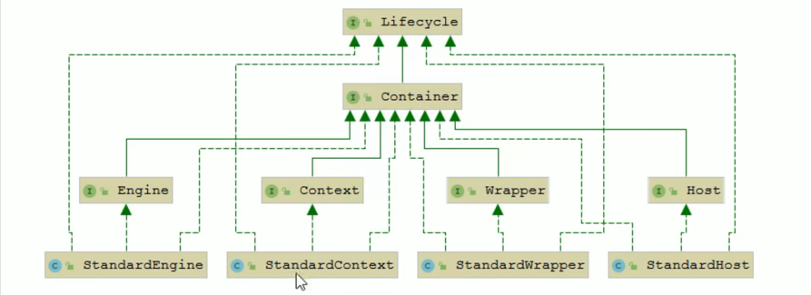

## Catalina
Tomcat is essentially a servlet container. Therefore, the servlet container called Catalina is the 
core module of Tomcat.

Tomcat adopts component-based design, and its components are all configurable. The outermost component, 
as the top container, is the Server container. other configurable components are in it.

How does tomcat manage these components?

Tomcat adopts **composite pattern** to organize and manage these components.

Catalina的load方法主要是根据conf/server.xml配置文件利用Digester创建服务器组件，然后调用Server的init方法，
逐层次的实现所有组件的初始化。