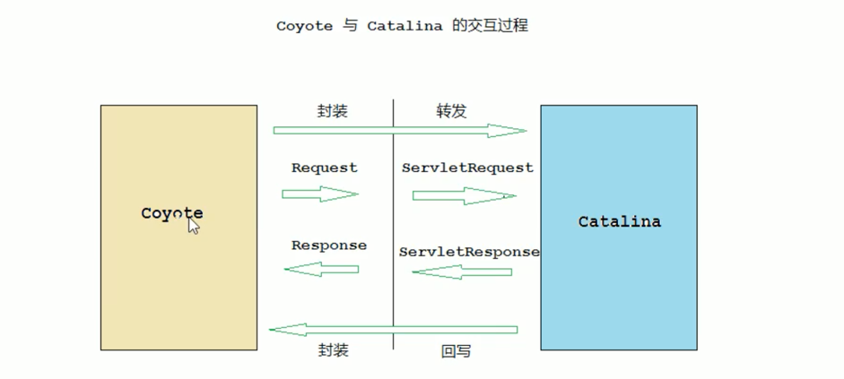
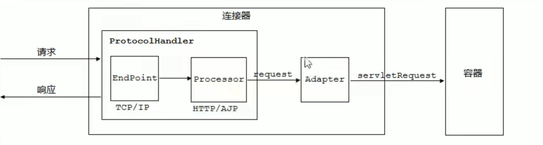
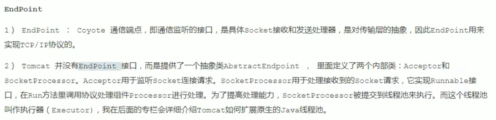
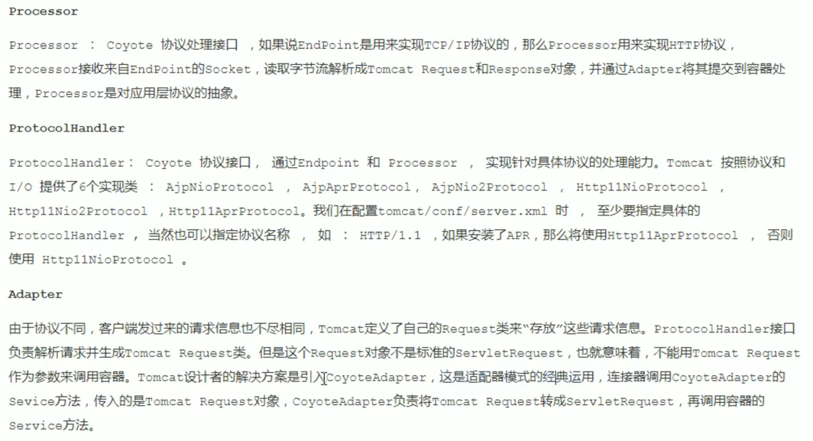

## What is Coyote ?
Coyote is the name of the Tomcat's connector component, and is the external api for the clients to 
visit. The clients build the connection with the server, send the request and receive the response 
through Coyote.

## The works Coyote does and Its Architecture.
Coyote encapsulates the underlying network communication, including the Socket request and handling. 
It provides unified interfaces for the Catalina container, **decoupling** Catalina from specific 
request protocol and I/O operation mode.




The pic above shows the interaction process between catalina and coyote. The coyote, as an isolated 
module, is only responsible for resolving the related specific communication protocol and I/O mode.
It is not related to the implementation of the Servlet specification.

It is worth noting that Coyote encapsulates the Socket input to the Request Object, which does not 
implement the servlet interface, and transfer the object to Catalina container. And then, Catalina 
will go on encapsulating the request object to the ServletRequest object, and handle further.

## I/O mode and Protocol supported in Coyote.


To support various I/O modes and application layer protocols, **one container in Tomcat is likely 
linked to several connectors**. Isolated container or connector can not provide public serves, which, 
therefore, needs them to work together, and forms a service.

Tomcat can have several services, and every service composes of several connectors and one container. 
**Considering flexibility of tomcat, configuring various services can allow us to visit various web 
applications in tomcat through various ports.**

## 4. Components in Coyote.



The architecture of the Coyote component is shown in the pic above. It is mainly composed of three 
sub-components including Endpoint, Processor and Adapter logically.




### 4.1 EndPoint
It is an abstraction for the transport layer.

Logically, the EndPoint component is responsible for monitoring the communication port, receiving the 
socket data and sending it to the processor.

#### 4.1.1 AbstractEndpoint
As shown in source codes, the abstract class called AbstractEndpoint encapsulates some common attributes 
or functions of the specific classes. We noticed the member executor and acceptor, and the latter is 
the thread used to accept new connections and pass them to worker threads.
```java
public abstract class AbstractEndpoint {
  /**
   * External Executor based thread pool.
   */
  private Executor executor = null;
  /**
   * Thread used to accept new connections and pass them to worker threads.
   */
  protected Acceptor<U> acceptor;

  public void createExecutor() {
    internalExecutor = true;
    TaskQueue taskqueue = new TaskQueue();
    TaskThreadFactory tf = new TaskThreadFactory(getName() + "-exec-", daemon, getThreadPriority());
    executor = new ThreadPoolExecutor(getMinSpareThreads(), getMaxThreads(), 60, TimeUnit.SECONDS,taskqueue, tf);
    taskqueue.setParent( (ThreadPoolExecutor) executor);
  }
}
```
#### 4.1.2 NioEndPoint
The NioEndPoint class extends the abstract class AbstractEndPoint.
It implements the abstract function startInternal and setSocketOptions.

Tomcat的NioEndpoint 实现了I/O多路复用模型。对于 Java 的多路复用器的使用，无非是两步：
1. 创建一个 Seletor，在它身上注册各种感兴趣的事件，然后调用 select 方法，等待感兴趣的事情发生。
2. 感兴趣的事情发生了，比如可以读了，这时便创建一个新的线程从 Channel 中读数据。

The function setSocketOptions processes the specified connection and the param is the SocketChannel.
It firstly gets a NioChannel, through checking the pool of re-usable NioChannel Objects or creating 
a new NioChannel Object if the stack pops none nio-channel.
```java
public class NioEndPoint extends AbstractJsseEndpoint<NioChannel,SocketChannel> {

  private Poller poller = null;

  /**
   * Bytebuffer cache, each channel holds a set of buffers (two, except for SSL holds four)
   */
  private SynchronizedStack<NioChannel> nioChannels;
  
  /**
   * Start the NIO endpoint, creating acceptor, poller threads.
   */
  @Override
  public void startInternal() throws Exception {

    if (!running) {
      running = true;
      
      /**
       * ...
       * ...
       */

      /**
       * bufferPool属性：可以创建的channels的数量。
       * 如果socket的配置属性bufferPool不为0，那么就可以创建nioChannel的同步栈。
       * 栈中的每一个成员为channel-nioChannel
       */
      if (socketProperties.getBufferPool() != 0) {
        nioChannels = new SynchronizedStack<>(SynchronizedStack.DEFAULT_SIZE,
            socketProperties.getBufferPool());
      }
      
      // Create worker collection
      if (getExecutor() == null) {
        createExecutor();
      }

      initializeConnectionLatch();

      // Start poller thread
      poller = new Poller();
      Thread pollerThread = new Thread(poller, getName() + "-Poller");
      pollerThread.setPriority(threadPriority);
      pollerThread.setDaemon(true);
      pollerThread.start();

      startAcceptorThread();
    }
  }

  /**
   * Process the specified connection.
   * @param socket The socket channel
   * @return <code>true</code> if the socket was correctly configured
   *  and processing may continue, <code>false</code> if the socket needs to be
   *  close immediately
   */
  @Override
  protected boolean setSocketOptions(SocketChannel socket) {
    NioSocketWrapper socketWrapper = null;
    
    try {
      // Allocate channel and wrapper
      NioChannel channel = null;
      if (nioChannels != null) {
        channel = nioChannels.pop();
      }
      if (channel == null) {
        SocketBufferHandler bufhandler = new SocketBufferHandler(
            socketProperties.getAppReadBufSize(),
            socketProperties.getAppWriteBufSize(),
            socketProperties.getDirectBuffer());
        if (isSSLEnabled()) {
          channel = new SecureNioChannel(bufhandler, this);
        } else {
          channel = new NioChannel(bufhandler);
        }
      }
      NioSocketWrapper newWrapper = new NioSocketWrapper(channel, this);
      channel.reset(socket, newWrapper);
      connections.put(socket, newWrapper);
      socketWrapper = newWrapper;
      // ...
      poller.register(socketWrapper);
      return true;
    } catch (Throwable t) {
      
    }
  }
  
}
```
#### 4.1.3 the member of Endpoint: SynchronizedStack<NioChannel>
类NioEndpoint中的成员变量SynchronizedStack<NioChannel>是NioChannel的对象池，NioChannel对SocketChannel封装，
使SSL与非SSL对外提供相同的处理方式。适用于数据量比较固定的场景，另外这个数据结构本身由数组维护，减少了维护节点的开销。

This is intended as a (mostly) GC-free alternative to java.util.Stack when the requirement is to 
create a pool of re-usable objects with no requirement to shrink the pool. The aim is to provide the 
bare minimum of required functionality as quickly as possible with minimum garbage.

补充：对象池(a pool of re-usable objects)

**在某些时候，我们需要频繁使用一些临时对象，如果每次使用的时候都申请新的资源，很有可能会引发频繁的 gc 而影响应用的流畅性。
这个时候如果对象有明确的生命周期，那么就可以通过定义一个对象池来高效的完成复用对象。**

比如每个请求任务，都需要用到类。若每次都需要重新new这些类，并不是很合适。而且在大量请求时，频繁创建和销毁这些类，
可能会导致内存抖动，影响性能。这个时候对象池的使用就很有必要了。

对象池通过对其所保存对象的共享与重用，缩减了应用线程反复重建、装载对象的过程所需要的时间，并且也有效地避免了频繁垃圾回收
带来的巨大系统开销。

#### 4.1.4 the member of Endpoint: Acceptor
The Acceptor class implements the runnable interface and override the run function. The run function
is important as it describes the process of receiving a request from the client.
```java
class Acceptor implements Runnable {
  @Override
  public void run() {
    try {
      // Loop until we receive a shutdown command
      while (!stopCalled) {
        try {
          //if we have reached max connections, wait
          endpoint.countUpOrAwaitConnection();

          // Endpoint might have been paused while waiting for latch
          // If that is the case, don't accept new connections
          if (endpoint.isPaused()) {
            continue;
          }

          U socket = null;
          try {
            // Accept the next incoming connection from the server
            // socket
            socket = endpoint.serverSocketAccept();
          } catch (Exception ioe) {

          }
          // Successful accept, reset the error delay
          errorDelay = 0;

          // Configure the socket
          if (!stopCalled && !endpoint.isPaused()) {
            // setSocketOptions() will hand the socket off to
            // an appropriate processor if successful
            if (!endpoint.setSocketOptions(socket)) {
              endpoint.closeSocket(socket);
            }
          } else { }
        } catch (Throwable t) { }
      }
    } finally {}
  }
}
```
#### 4.1.5 NioSocketWrapper
socketWrapper is the instance of NioSocketWrapper class, and is registered to the poller instance 
by invoking the register function for executors handling further.

#### 4.1.6 Poller
every poller instance has a NIO selector and an event queue. The NIO selector is intended to monitor 
whether the event registered on the socket occurs.

Poller 本质上就是一个Selector。内部维护一个线程安全的Queue，为SynchronizedQueue<PollerEvent>。
Poller 不断的通过内部的 Selector 对象向内核查询 Channel 的状态，一旦可读就生成任务类 SocketProcessor 交给 
Executor 去处理。Poller 的另一个重要任务是循环遍历检查自己所管理的 SocketChannel 是否已经超时，
如果有超时就关闭这个 SocketChannel。
```java
public class NioEndPoint extends AbstractJsseEndpoint<NioChannel,SocketChannel> {
  /**
   * Cache for poller events
   */
  private SynchronizedStack<PollerEvent> eventCache;
  /**
   * ...
   * ...
   */
  public class Poller implements Runnable {
    private Selector selector;
    private final SynchronizedQueue<PollerEvent> events =
        new SynchronizedQueue<>();

    public Poller() throws IOException {
      this.selector = Selector.open();
    }

    private void addEvent(PollerEvent event) {
      events.offer(event);
      if (wakeupCounter.incrementAndGet() == 0) {
        selector.wakeup();
      }
    }
    /**
     * Registers a newly created socket with the poller.
     *
     * @param socketWrapper The socket wrapper
     */
    public void register(final NioSocketWrapper socketWrapper) {
      socketWrapper.interestOps(SelectionKey.OP_READ);//this is what OP_REGISTER turns into.
      PollerEvent event = null;
      if (eventCache != null) {
        event = eventCache.pop();
      }
      if (event == null) {
        event = new PollerEvent(socketWrapper, OP_REGISTER);
      } else {
        event.reset(socketWrapper, OP_REGISTER);
      }
      addEvent(event);
    }

    /**
     * Processes events in the event queue of the Poller.
     *
     * @return <code>true</code> if some events were processed,
     *   <code>false</code> if queue was empty
     */
    public boolean events() {
      boolean result = false;

      PollerEvent pe = null;
      for (int i = 0, size = events.size(); i < size && (pe = events.poll()) != null; i++ ) {
        result = true;
        NioSocketWrapper socketWrapper = pe.getSocketWrapper();
        SocketChannel sc = socketWrapper.getSocket().getIOChannel();
        int interestOps = pe.getInterestOps();
        if (sc == null) {
          log.warn(sm.getString("endpoint.nio.nullSocketChannel"));
          socketWrapper.close();
        } else if (interestOps == OP_REGISTER) {
          try {
            sc.register(getSelector(), SelectionKey.OP_READ, socketWrapper);
          } catch (Exception x) {
            log.error(sm.getString("endpoint.nio.registerFail"), x);
          }
        } else {
          final SelectionKey key = sc.keyFor(getSelector());
          if (key == null) {
            // The key was cancelled (e.g. due to socket closure)
            // and removed from the selector while it was being
            // processed. Count down the connections at this point
            // since it won't have been counted down when the socket
            // closed.
            socketWrapper.close();
          } else {
            final NioSocketWrapper attachment = (NioSocketWrapper) key.attachment();
            if (attachment != null) {
              // We are registering the key to start with, reset the fairness counter.
              try {
                int ops = key.interestOps() | interestOps;
                attachment.interestOps(ops);
                key.interestOps(ops);
              } catch (CancelledKeyException ckx) {
                cancelledKey(key, socketWrapper);
              }
            } else {
              cancelledKey(key, socketWrapper);
            }
          }
        }
        if (running && eventCache != null) {
          pe.reset();
          eventCache.push(pe);
        }
      }
      return result;
    }
  }
}
```
分析一下Poller类的register方法：

主要是利用 NioSocketWrapper 创建了一个事件PollerEvent，并且将事件添加进内部维护的一个线程安全的队列 events ，在这个
过程中，势必是需要 PollerEvent 类对象的，但并没有直接就使用new 创建一个类对象，而是先试图去对象池里 pop 一个，如果没有
再new 创建一个对象，如果有，则调用reset 方法，重设对象的属性。

然后在方法events()中用完后，再放回对象池。可见上述代码，其中具体代码为: pe.reset(); eventCache.push(pe);


#### 4.1.7 SocketProperties
The SocketProperties class is the Properties that can be set in the <Connector> element in the Tomcat 
configuration file server.xml. All properties are prefixed with "socket." and are currently only 
working for the Nio connector.

The class has an attribute named **bufferPool**, which is the NioChannel pool size for the endpoint,
namely the number of the channels and -1 means unlimited cached, 0 means no cache.

The attribute bufferPoolSize is Buffer pool size in bytes to be cached, which will change dynamically 
according to JVM max heap in Tomcat 10. 

### 4.2 Processor
It is an abstraction for the application layer.

Processor component is a protocol-handling component. It receives the socket from the Endpoint component, 
resolving the bytes stream data to the Request Object, and invokes the service of Adapter to transfer 
the Request Object to the ServletRequest Object used by the container.

### 4.3 Adapter
Transfer the request object to the ServletRequest object the container needs.

