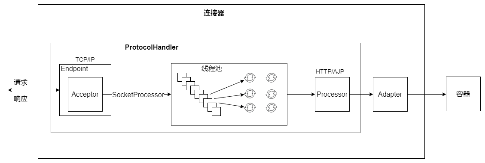
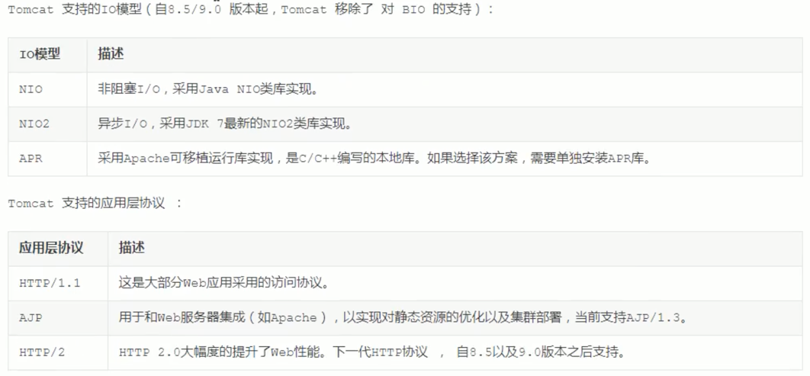

## What is Coyote ?
Coyote is the name of the Tomcat's connector component, and is the external api for the clients to 
visit. The clients build the connection with the server, send the request and receive the response 
through Coyote.

## The works Coyote does and Its Architecture.
Coyote encapsulates the underlying network communication, including the Socket request and handling. 
It provides unified interfaces for the Catalina container, **decoupling** Catalina from specific 
request protocol and I/O operation mode.

The pic above shows the interaction process between catalina and coyote. The coyote, as an isolated 
module, is only responsible for resolving the related specific communication protocol and I/O mode.
It is not related to the implementation of the Servlet specification.

It is worth noting that Coyote encapsulates the Socket input to the Request Object, which does not 
implement the servlet interface, and transfer the object to Catalina container. And then, Catalina 
will go on encapsulating the request object to the ServletRequest object, and handle further.

## I/O mode and Protocol supported in Coyote.
下面图片中展示的是 Tomcat9 Connector 支持的 I/O 模型以及通信协议。（图片来源于网络）

To support various I/O modes and application layer protocols, **one container in Tomcat is likely 
linked to several connectors**. Isolated container or connector can not provide public serves, which, 
therefore, needs them to work together, and forms a service.

Tomcat can have several services, and every service composes of several connectors and one container. 
**Considering flexibility of tomcat, configuring various services can allow us to visit various web 
applications in tomcat through various ports.**

## 4. Components in Coyote.
通过上文中图片我们也能看到，Coyote主要由两部分组成：**ProtocolHandler and Adapter**，其中 ProtocolHandler 
又是由 **Endpoint 和 Processor** 组成。

### 4.1 ProtocolHandler
ProtocolHandler 是个抽象接口，抽象了协议实现，包括线程等。是 Coyote 协议实现的主要接口。

Coyote 协议抽象类 [AbstractProtocol](./Coyote/AbstractProtocol.md) 实现了该接口。

需要指出的是，**提供低层网络 I/O 服务的 Endpoint 必须得和 ProtocolHandler 的实现相匹配，例如：如果 
ProtocolHandler 使用了 NIO 模型, 那么就需要相应的 NIO Endpoint 实现**。

### 4.2 Adapter
Transfer the request object to the ServletRequest object the container needs.

Adapter 也是一个抽象接口，表示的是基于 coyote 的 servlet 容器中的入口点。

