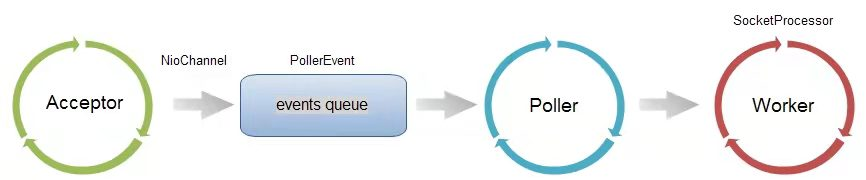

##1. Overview
ProtocolHandler 包含了 Endpoint 和 Processor 两个部分。整体的结构如下图所示。

##2. Members
###2.1 Endpoint
It is an abstraction for the transport layer. Logically, the EndPoint component is responsible for
monitoring the communication port, receiving the socket data and sending it to the processor.

抽象类 [AbstractEndpoint](./Endpoint/abstract_endpoint.md)

###2.2 Processor
It is an abstraction for the application layer.

Processor component is a protocol-handling component. It receives the socket from the Endpoint component,
resolving the bytes stream data to the Request Object, and invokes the service of Adapter to transfer
the Request Object to the ServletRequest Object used by the container.