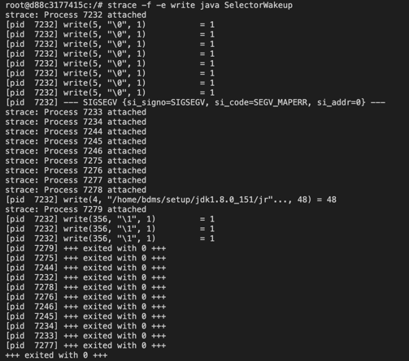

## Overview
Selector 是 Java 世界中的**多路复用**。

选择器(Selector)是 SelectableChannel 对象的多路复用器。Selector 可以同时监控多个 SelectableChannel 的 IO 
状况，也就是说，利用 Selector 可实现一个单独的线程管理多个 Channel。Selector 是非阻塞 IO 的核心。

select 本身是阻塞的，当它管理的某个通道就绪时，就会返回就绪的通道供给程序读写操作。对于应用程序来说，只需要单个线程
便可以维护多个通道。这将带来很大的伸缩性。

## Functions
### select() 
调用此方法，获取是否有注册在原始 socket 上的事件发生。会将上次 select 之后的准备好的 channel 对应的 SelectionKey 
复制到 selected set 中。如果没有任何通道准备好，这个方法会***阻塞***，直到至少有一个通道准备好。

### select(long timeout)
如果没有通道准备好，此方法会阻塞等待一会，等待时间为 timeout。

### selectNow()
功能和 select 一样，区别在于如果没有准备好的通道，那么此方法会立即返回 0。

### wakeup()
这个方法是用来唤醒等待在 select() 和 select(timeout) 上的线程的。如果 wakeup() 先被调用，此时没有线程在 select 
上阻塞，那么之后的一个 select() 或 select(timeout) 会立即返回，而不会阻塞，当然，它只会作用一次。

NIO 中的 Selector 封装了底层的系统调用，其中 wakeup 用于唤醒阻塞在 select 方法上的线程，它的实现很简单:

在 linux 上就是创建一个管道并加入 poll 的 fd(file descriptor) 集合，wakeup 就是往管道里写一个字节，那么阻塞的 
poll 方法有数据可读就立即返回。证明这一点很简单，strace 即可知道，结合代码
[SelectorWakeup.java](../../../../../bottomlevel/src/SelectorWakeup.java)。

在 Ubuntu 中借助工具 strace 分析，结果见下图所示。(strace 是 Linux 环境下的一款程序调试工具，用来监察一个应用程序
所使用的系统调用。)

### key()
已注册的键

### selectedKeys()
已选择(就绪)的键 SelectionKey

#### SelectionKey
选择键 SelectionKey 封装了特定的通道与特定的选择器的注册关系。
一个Selector中可以注册多通道，不同通道在选择器中被封装成为 SelectionKey 对象。

#### SelectionKey.attachment()
可以将一个或者多个附加对象绑定到SelectionKey上，以便容易的识别给定的通道。通常有两种方式:
- 在注册的时候直接绑定:
  SelectionKey key=channel.register(selector,SelectionKey.OP_READ,theObject); 
- 在绑定完成之后附加:
  selectionKey.attach(theObject); //绑定

绑定之后，可通过对应的 SelectionKey 取出该对象: selectionKey.attachment();

如果要取消该对象，则可以通过该种方式: selectionKey.attach(null);

需要注意的是如果附加的对象不再使用，一定要人为清除，因为垃圾回收器不会回收该对象，若不清除的话会成内存泄漏。

### cancel()
已取消的键