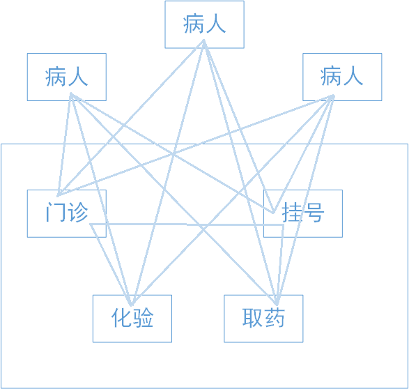

## 组合模式
如果应用的核心模型能用树状结构表示，在应用中使用组合模式才有价值。

对于绝大多数需要生成树状结构的问题来说， 组合都是非常受欢迎的解决方案。 组合最主要的功能是在整个树状结构上递归调用方法
并对结果进行汇总。

统一处理简单和复杂的对象。

## 适配器模式

## 模版模式

## 门面模式（Facade Pattern 外观模式）
门面模式(Facade Pattern)：外部与一个子系统的通信必须通过一个统一的外观对象进行，为子系统中的一组接口提供一个一致的
界面，外观模式定义了一个高层接口，这个接口使得这一子系统更加容易使用。

门面模式又称为外观模式，它是一种对象结构型模式。

举一个现实中的例子，如下图所示。

改为:

门面模式的结构如下图所示:

