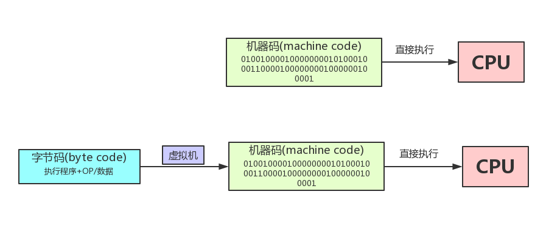

## Java EE   
Java EE是一种架构,也可以说是一种技术规范. Java EE 是由一系列抽象的标准规范所组成,
是针对企业级软件开发中普遍面临问题的一套解决方案. Java EE 是将JSR文档以代码
的形式展现出来 **(每个抽象的JSR规范都是要求有对应的参考实现的.)**.

也就是说, Java EE = 多个JSR正式规范 + 运行环境.

Java EE 作为一套技术规范,其商业实现产品有多种,单单国产的Java EE应用服务器实现就有3个. "一种规范 + 多种实现"的方式
对企业非常友好, 当企业遇到某供应商产品服务不靠谱的话迁移起来就很容易.

Java EE SDK则是java提供的用于开发企业级应用的开发工具包. 它是在Java SE SDK的基础上添加了一些额外的jar包.
用于支持企业级应用开发. 包括但不限于: ejb,servlet,jsp,xml,jpa等;   

企业级应用开发一般分为两个阵营: **1、使用Java EE开发; 2、使用Spring这种所谓的轻量级企业应用框架开发;**

Servlet 是 J2EE 最重要的一部分，有了 Servlet 你就是 J2EE 了，J2EE 的其他方面的内容择需采用。
而 Servlet 规范你需要掌握的就是 servlet 和 filter 这两项技术。绝大多数框架不是基于 servlet 就是基于 filter，
**如果它要在 Servlet 容器上运行，就永远也脱离不开这个模型。**

相关概念:  
1、JCP 与 JSR.  
Java Community Process是一个由oracle（曾经是sun）领导的,负责管理java和接受各种Java Specification Requests的
组织,这个组织很多大厂（例如谷歌，IBM等）都加入了. 
Java Specification Request(JSR)是java的spec,在没有正式确定某版本之前会存在很多Java Specification Requests,
最终JSR会由JCP的成员投票决定. 例如: lambda在JSR335的相关讨论.

## Web.xml
如果 Web 应用不包含任何 servlet、过滤器、或监听器组件或使用注解声明相同的，那么可以不需要 web.xml 文件。
换句话说，只包含静态文件或 JSP 页面的应用程序并不需要一个 web.xml 的存在。

## service()方法
实际上, 在执行doGet()或者doPost()之前,都会先执行service(). 由service()方法进行判断,
到底该调用doGet()还是doPost();   
service(), doGet(), doPost() 三种方式的参数列表都是一样的;   
所以,有时候也会直接重写service()方法,在其中提供相应的服务,就不用区分到底是在doGet还是doPost中了。

## JSP
Servlet的一个比较明显的弊端就是在Servlet中编写html代码很痛苦,效率不高,可读性差,难以维护.   
最好可以在.html文件里面写html代码,同时又能在里面调用java的变量,那也就是JSP了.

为什么JSP可以在html中运行java代码? 因为JSP被转译成了Servlet.

访问Tomcat中JSP页面的执行过程如下:
1. 把 xx.jsp转译为xx_jsp.java;
2. xx_jsp.java 位于tomcat\work\Catalina\localhost\web模块名\org\apache\jsp;
3. xx_jsp.java是一个servlet; xx_jsp.java 被编译为 xx_jsp.class;
4. 执行xx_jsp.class, 生成html;
5. 通过http协议把html 响应返回给浏览器;

xx_jsp.java 继承了类 org.apache.jasper.runtime.HttpJspBase, 而这个类又继承了HttpServlet.


## Byte code ｜ Machine code


## classpath | jar
### 1.classpath是什么？
Java是编译型语言，源码文件是.java，而编译后的.class文件才是真正可以被JVM执行的字节码。
因此，JVM需要知道，如果要加载一个类，应该去哪找对应的.class文件。
而classpath ***是JVM需要用到的一个环境变量***，它用来指示JVM如何搜索.class文件。

所以，classpath就是 **一组目录的集合**，它设置的搜索路径与操作系统相关。
- 在windows系统下，多个目录使用;分隔开，带有空格的路径需要使用""框上；
- 在linux系统下，使用: 分隔开；

### 2.classpath两种设定方法.
- 在系统环境变量中设置classpath环境变量，不推荐；
- 在启动JVM时设置classpath变量，推荐。

不推荐在系统环境变量中设置classpath，那样会污染整个系统环境。推荐在启动JVM时设置classpath。
实际上就是给java命令传入-classpath或-cp参数。
没有设置系统环境变量，也没有传入-cp参数，那么JVM默认的classpath为.，即 ***当前目录***。

### 3.结合Intellij 编译器分析.

上图是编译器Intellij在执行test.java文件时候，终端Run显示的内容。可见，是执行命令语句。   
执行命令总体的格式为: java -javaagent ... -classpath ... source_file;    
这个属于是在JVM启动时，设置classpath变量的设定方法。

我们来关注classpath的内容，其实，大部分classpath目录可以在intellij-Project structure中可见，见下图。

当指定本地JDK Home Path的时候，classpath的内容就同时确定了。
```
我们注意到倒数四个classpath，这个是自定义的classpath目录，compile output path 和 额外添加的第三方依赖包的路径。
1、compile output path是javac 编译.java文件的输出路径，可以在intellij编译器中自定义修改，编译输出为.class文件。
2、额外添加的第三方依赖包路径同样可以在intellij-Project Structure-Dependencies中指定。
```
**所以Run执行无非就是编译.java文件输出.class文件至指定路径目录下，然后通过java运行命令来运行目标文件。
参数-classpath 指定或者说囊括所有需要的.class文件，然后在这些目录下搜索目标.class文件并执行。**

### 4.Tomcat中有关classpath.

上图为Tomcat源码的Shell脚本Catalina.sh中，在启动JVM时候额外添加的classpath。添加了两个jar包路径，
分别为bootstrap.jar 和 tomcat-juli.jar。

上图为终端执行sh脚本启动tomcat时候，打印出来的日志记录，可以看见添加的classpath信息，与上文对应上了。

### 5.Jar包是什么？Jar包的作用？
如果有很多.class文件，散落在各层目录中，肯定不便于管理。如果能把目录打一个包，变成一个文件，就方便多了。

jar包就是用于此，它将package组织的目录层级，以及各个目录下的所有文件（包括.class文件和其他文件）都打成一个jar文件；
这样一来，无论是备份，还是发给客户，就方便多了。

Jar包其实就是一个zip格式的压缩文件，而jar包相当于**目录**。
```
例如: 如果想要执行当前目录下Jar包 Example.jar中的一个class: context1/context2/target.class.
那么执行命令就为: java -cp ./Example.jar context1/context2/target.class.
那么JVM就会在Example.jar目录中去搜索target类并执行.
```
手动创建Jar包的方式也很简单: 将文件夹先创建为zip格式压缩包，然后将后缀改为jar即可。

jar包还可以包含一个特殊的/META-INF/MANIFEST.MF文件，MANIFEST.MF是纯文本，可以指定Main-Class和其它信息。
JVM会自动读取这个 **MANIFEST.MF文件**，如果存在Main-Class，我们就不必在命令行指定启动的类名，而是用更方便的命令:
`java -jar Example.jar`

jar包还可以包含其它jar包，这个时候，就需要在MANIFEST.MF文件里配置classpath了。
在大型项目中，不可能手动编写MANIFEST.MF文件，再手动创建zip包。Java社区提供了大量的开源构建工具，例如Maven，
可以非常方便地创建jar包。

### 6.开发.java文件时导入其它类.
在开发某个java源文件中，无法直接使用其他文件中的类，除非使用的目标类能被classpath的路径搜索到。
要引用非classpath下的其他类，只能将其添加到classpath或者装入同一package中，然后引用包中的类。

## Class Loaders in Java.

上图展示的是Java中的主要的四个类加载器，它们之间的组合关系，以及它们所对应的类加载路径。这几个类加载器在处理类加载请求
的时候，采用的是图中所写双亲委派模式【Java 1.2之后引入的】。

在Java的日常应用程序开发中，类的加载几乎是由前三个类加载器相互配合执行的，
在必要时，我们还可以自定义类加载器。

Java虚拟机对.class文件采用的是按需加载的方式，也就是说当需要使用该类时才会将它的class文件加载到内存生成class对象。

而且加载某个类的class文件时，Java虚拟机采用的是双亲委派模式即把加载请求先交由父类处理，**也就是先看看父类加载器
有没有该类，是否能完成加载任务，如果有，则不用自己加载，反之，自己再加载目标类。**

JVM搜索的是.Class, JVM中只有类路径classpath, 而没有文件系统路径。供JVM搜索的类路径由环境变量classpath决定，
且有先后顺序。注意，虚拟机不会递归搜索classpath定义的路径。

## Class Loaders in Tomcat.


其中，位于图片中上方的三个类加载器(Bootstrap|Extension|Application ClassLoader)是 JVM 提供的。
CommonClassLoader、CatalinaClassLoader 以及 ShareClassLoader，是Tomcat独有的，
在BootStrap.java初始化操作中，进行类加载器初始化。

Bootstrap Classloader是JVM 自身的一部分，主要加载的是JVM 自身需要的类，这个类加载器是使用C++语言实现的。