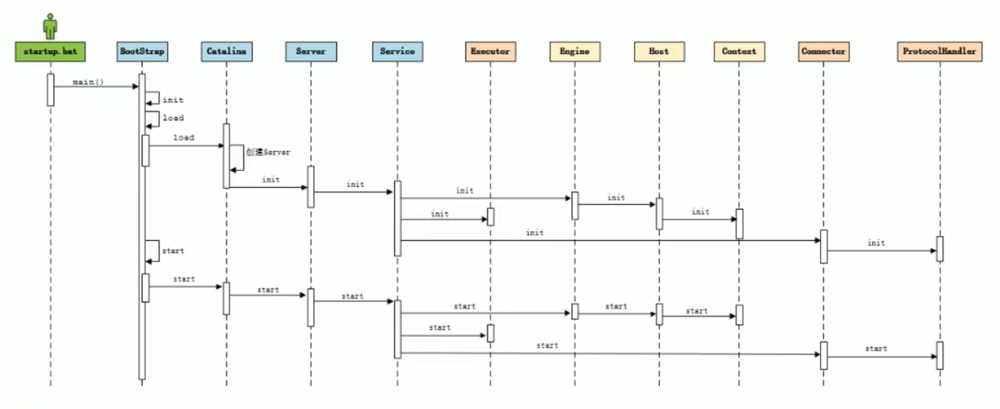

## The overall architecture of Tomcat.
Before designing a system, we should clarify the requirements firstly. According to the pic2 above, 
Tomcat has to meet two main module functions, including the http server and the servlet container.
Namely, it has to obtain two functions: 
1. handling the Socket connection and transformation to request/response object.
2. loading and managing the servlet, and handling the http request.


For obtaining the two functions, Tomcat provides two core components called [Connector](./Coyote.md) 
and [Container](./Container.md) corresponding to the two requirements. The connector is responsible 
for external communication and the container for internal processing.

## HTTP Server
HTTP Server is intended to receive the http format request which the browsers send, handles the
request and then sends back the response to the browsers.

The http server handles the request by invoking the service program. The service program, business
class namely, is written by ourselves.


As is shown in the picture above, two ways to call the business classes are compared.

- The first way is that http server invokes the various serves that the business classes provide
  directly. Although this approach can also achieve the task goal, it has obvious weakness that strong
  coupling exists between the http server program and the business classes.
- However, In the second way, the http server program transfers the request to servlet container
  directly. Namely, the work of deciding which business class to execute is handed over to the servlet
  container, which results in decoupling server programs from business classes.


The above picture shows the process flow of the servlet container.

When the browser requests a resource in the server, the http server will encapsulate the request info
using a ServletRequest Object and invoke the service function of the servlet container. The function
will get the url info from the ServletRequest object and map it to the right servlet. If the servlet
has not been loaded, it will create the servlet using the reflection mechanism and complete the init
by invoking the init function, and then handle the request in the service function, returning a
ServletResponse object to the http server.

## The LifeCycle of Tomcat

### Init

### Start



The pic above is composed of two parts from an overall view. The top part shows the initiation process 
of several components of tomcat, and the part below shows the starting process of components.

```java
/**The main function of Bootstrap.java invokes its load function, which invokes the load function of 
Catalina.java further.

The following function is the function called load in Catalina.java.
 **/
public class Catalina {
  public static final String SERVER_XML = "conf/server.xml";
  protected String configFile = SERVER_XML; // 初始化变量configFile为SERVER_XML.
  public void setConfigFile(String file) {
    configFile = file;
  }
  public String getConfigFile() {
    return configFile;
  }
  /**
   * Return a File object representing our configuration file.
   * @return the main configuration file
   */
  protected File configFile() {

    File file = new File(configFile);
    if (!file.isAbsolute()) { // if path is not absolute path.
      file = new File(Bootstrap.getCatalinaBase(), configFile);
    }
    return file;
  }
  /**
   * Start a new server instance.
   */
  public void load() {

    if (loaded) {
      return;
    }
    loaded = true;

    long t1 = System.nanoTime();

    initDirs();

    // Before digester - it may be needed
    initNaming();

    // Parse main server.xml
    parseServerXml(true);
    Server s = getServer();
    if (s == null) {
      return;
    }

    getServer().setCatalina(this);
    getServer().setCatalinaHome(Bootstrap.getCatalinaHomeFile());
    getServer().setCatalinaBase(Bootstrap.getCatalinaBaseFile());

    // Stream redirection
    initStreams();

    // Start the new server
    try {
      getServer().init();
    } catch (LifecycleException e) {
      if (Boolean.getBoolean("org.apache.catalina.startup.EXIT_ON_INIT_FAILURE")) {
        throw new java.lang.Error(e);
      } else {
        log.error(sm.getString("catalina.initError"), e);
      }
    }

    if(log.isInfoEnabled()) {
      log.info(sm.getString("catalina.init", Long.toString(TimeUnit.NANOSECONDS.toMillis(System.nanoTime() - t1))));
    }
  }

  protected void parseServerXml(boolean start) {
    
  }
}
```

We can see that the parseServerXml function is invoked to parse the config file server.xml. The 
function is shown in the following code block.
```java
class Catalina {
  protected void parseServerXml(boolean start) {
    // Set configuration source
    ConfigFileLoader.setSource(new CatalinaBaseConfigurationSource(Bootstrap.getCatalinaBaseFile(), getConfigFile()));
    File file = configFile();

    if (useGeneratedCode && !Digester.isGeneratedCodeLoaderSet()) {
      // Load loader
      String loaderClassName = generatedCodePackage + ".DigesterGeneratedCodeLoader";
      try {
        Digester.GeneratedCodeLoader loader = (Digester.GeneratedCodeLoader)
            Catalina.class.getClassLoader().loadClass(loaderClassName).getDeclaredConstructor().newInstance();
        Digester.setGeneratedCodeLoader(loader);
      } catch (Exception e) {
        if (log.isDebugEnabled()) {
          log.info(sm.getString("catalina.noLoader", loaderClassName), e);
        } else {
          log.info(sm.getString("catalina.noLoader", loaderClassName));
        }
        // No loader so don't use generated code
        useGeneratedCode = false;
      }
    }

    // Init source location
    File serverXmlLocation = null;
    String xmlClassName = null;
    if (generateCode || useGeneratedCode) {
      xmlClassName = start ? generatedCodePackage + ".ServerXml" : generatedCodePackage + ".ServerXmlStop";
    }
    if (generateCode) {
      if (generatedCodeLocationParameter != null) {
        generatedCodeLocation = new File(generatedCodeLocationParameter);
        if (!generatedCodeLocation.isAbsolute()) {
          generatedCodeLocation = new File(Bootstrap.getCatalinaHomeFile(), generatedCodeLocationParameter);
        }
      } else {
        generatedCodeLocation = new File(Bootstrap.getCatalinaHomeFile(), "work");
      }
      serverXmlLocation = new File(generatedCodeLocation, generatedCodePackage);
      if (!serverXmlLocation.isDirectory() && !serverXmlLocation.mkdirs()) {
        log.warn(sm.getString("catalina.generatedCodeLocationError", generatedCodeLocation.getAbsolutePath()));
        // Disable code generation
        generateCode = false;
      }
    }

    ServerXml serverXml = null;
    if (useGeneratedCode) {
      serverXml = (ServerXml) Digester.loadGeneratedClass(xmlClassName);
    }

    if (serverXml != null) {
      serverXml.load(this);
    } else {
      try (ConfigurationSource.Resource resource = ConfigFileLoader.getSource().getServerXml()) {
        // Create and execute our Digester
        Digester digester = start ? createStartDigester() : createStopDigester();
        InputStream inputStream = resource.getInputStream();
        InputSource inputSource = new InputSource(resource.getURI().toURL().toString());
        inputSource.setByteStream(inputStream);
        digester.push(this);
        if (generateCode) {
          digester.startGeneratingCode();
          generateClassHeader(digester, start);
        }
        digester.parse(inputSource);
        if (generateCode) {
          generateClassFooter(digester);
          try (FileWriter writer = new FileWriter(new File(serverXmlLocation,
              start ? "ServerXml.java" : "ServerXmlStop.java"))) {
            writer.write(digester.getGeneratedCode().toString());
          }
          digester.endGeneratingCode();
          Digester.addGeneratedClass(xmlClassName);
        }
      } catch (Exception e) {
        log.warn(sm.getString("catalina.configFail", file.getAbsolutePath()), e);
        if (file.exists() && !file.canRead()) {
          log.warn(sm.getString("catalina.incorrectPermissions"));
        }
      }
    }
  }
}
```

A Digester instance is used to parse the config file and generate codes.


