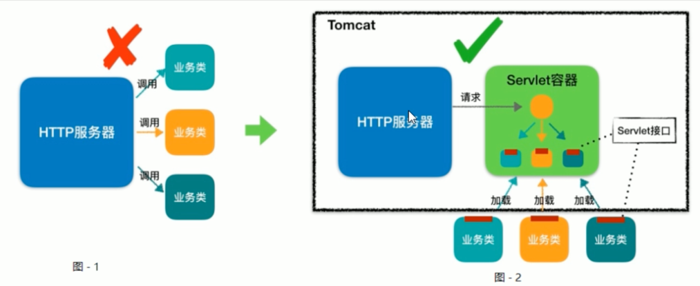
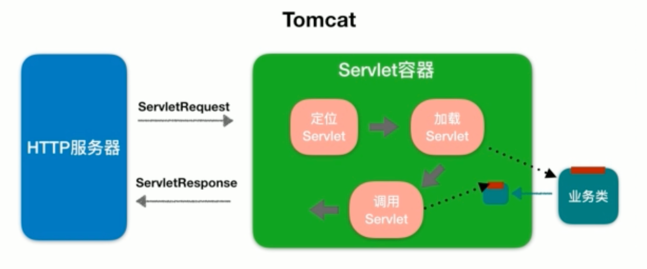
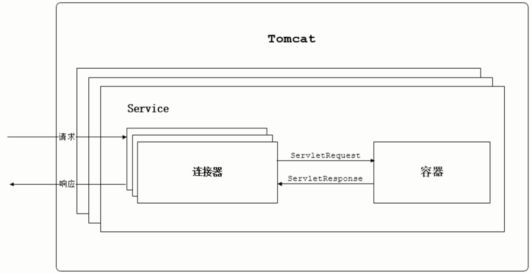

## HTTP Server
HTTP Server is intended to receive the http format request which the browsers send, handles the
request and then sends back the response to the browsers.

The http server handles the request by invoking the service program. The service program, business 
class namely, is written by ourselves.

As is shown in the picture above, two ways to call the business classes are compared.

- The first way is that http server invokes the various serves that the business classes provide 
directly. Although this approach can also achieve the task goal, it has obvious weakness that strong 
coupling exists between the http server program and the business classes.
- However, In the second way, the http server program transfers the request to servlet container 
directly. Namely, the work of deciding which business class to execute is handed over to the servlet 
container, which results in decoupling server programs from business classes.

The above picture shows the process flow of the servlet container.

When the browser requests a resource in the server, the http server will encapsulate the request info
using a ServletRequest Object and invoke the service function of the servlet container. The function 
will get the url info from the ServletRequest object and map it to the right servlet. If the servlet 
has not been loaded, it will create the servlet using the reflection mechanism and complete the init 
by invoking the init function, and then handle the request in the service function, returning a 
ServletResponse object to the http server.

## The overall architecture of Tomcat.
Before designing a system, we should clarify the requirements firstly. According to the pic2 above, 
Tomcat has to meet two main module functions, including the http server and the servlet container.
Namely, it has to obtain two functions: 
1. handling the Socket connection and transformation to request/response object.
2. loading and managing the servlet, and handling the http request.

For obtaining the two functions, Tomcat provides two core components called [Connector](./Coyote.md) 
and [Container](./Container.md) corresponding to the two requirements. The connector is responsible for external 
communication and the container for internal processing.